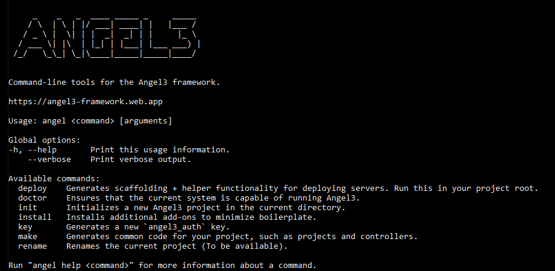

# Angel3 CLI

[](https://github.com/dukefirehawk/angel3-cli)

[](https://pub.dartlang.org/angel3_cli)
[](https://dart.dev/null-safety)
[](https://gitter.im/angel_dart/discussion)

[](https://github.com/dukefirehawk/angel3-cli/blob/master/LICENSE)

Command-line tools for the Angel3 framework that provides the following functionalities:

* Project scaffolding
* Generating service models, plugins, tests and more
* Renaming projects
* Much more...

## Installation

Release version:

```bash
dart pub global activate angel3_cli
```

Development version:

```bash
dart pub global activate --source git https://github.com/dukefirehawk/angel3-cli
```

## Help

For information on the available options:

```bash
angel3 help
```
