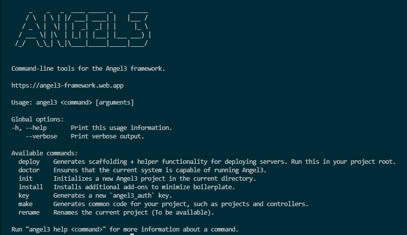

# Angel3 CLI

[] (https://github.com/dukefirehawk/angel3-cli)


[](https://dart.dev/null-safety)
[](https://gitter.im/angel_dart/discussion)
[](https://github.com/dukefirehawk/angel3-cli/blob/master/LICENSE)

The command line interface for buidling dart backend in [Angel3 framework](https://pub.dev/packages/angel3_framework) that provides the following functionalities:

* Project scaffolding
* Generating service models, plugins, tests and more
* Renaming projects
* Much more...

## Installation

```bash
dart pub global activate angel3_cli
```

## Help

For information on the available options:

```bash
angel3 help
```

[](https://github.com/dukefirehawk/angel3-cli)
